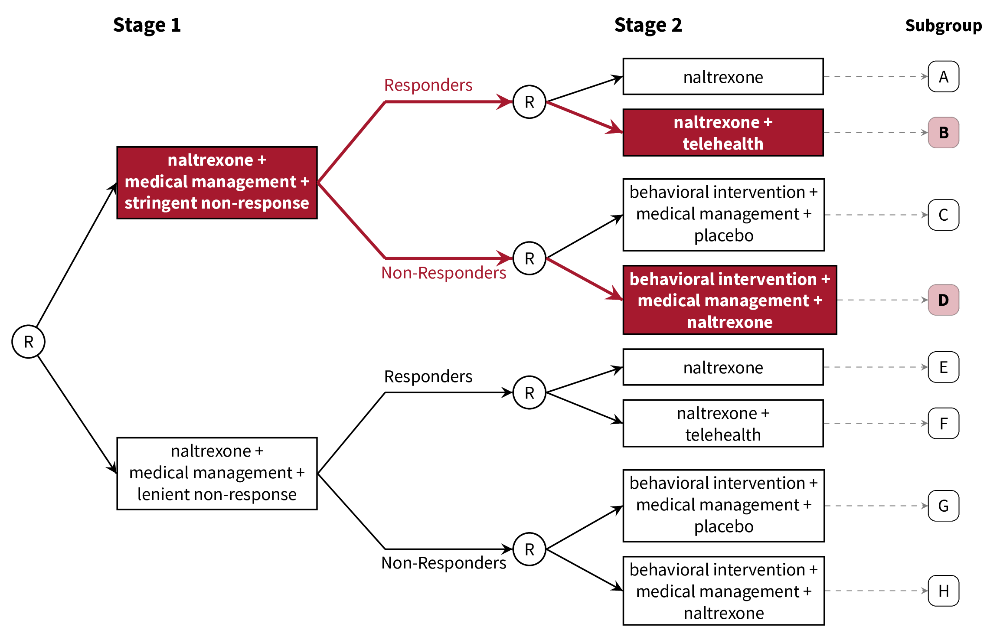

class: inverse, center, middle

```{r setup, include=FALSE}
options(htmltools.dir.version = FALSE)
knitr::opts_chunk$set(echo = FALSE)

library(khroma)  # for colors
library(here)    # for file paths
library(emo)     # for emoji
# library(fontawesome) 

colscheme <- color("romaO")

set.seed(1059)

# helper functions
expit <- \(x) exp(x) / (1 + exp(x))

source(here("bibhelper.R"))
library(RefManageR)
BibOptions(check.entries = FALSE, 
           bib.style = "authoryear", 
           cite.style = "authoryear",
           style = "markdown",
           dashed = TRUE,
           max.names = 1)
bib <- ReadBib(here("refs.bib"))
```

```{r xaringan-themer, include = FALSE, warning = FALSE}
library(xaringanthemer)
style_duo_accent(primary_color = "#002D72", # JHU Heritage Blue
                 secondary_color = "#68ACE5", # JHU Spirit Blue
                 header_font_google = google_font("Source Serif Pro", "600", "600i"),
                 text_font_google = google_font("Source Sans Pro", "400", "400i", "600"),
                 code_font_google = google_font("Soure Code", "400"),
                 text_font_size = "22pt",
                 code_font_size = "18pt",
                 header_background_auto = TRUE)

xaringanExtra::use_tachyons()
xaringanExtra::use_scribble()
xaringanExtra::use_fit_screen()
```

# Follow along!

Slides are available at [urmc-smarts-2021.netlify.app](urmc-smarts-2021.netlify.app)

Materials are partially adapted from workshops given by the [d3lab](https://d3lab.isr.umich.edu) at the University of Michigan Institute for Social Research and from `r TextCite(bib, "seewaldSequentialMultipleAssignment2021")`.

---
# What is a dynamic treatment regimen?

A **dynamic treatment regimen (DTR)** is

- an *intervention* design that 
- adapts the type, timing, intensity, or dose of treatment over time
- according to a patient's specific and changing needs.

--

In practice, a dynamic treatment regimen is a sequence of decision rules that can be used to guide how treatment can be adapted and readapted to an individual.

--
.center[
### Sounds a lot like clinical practice!
]

--
**MANY other names**: adaptive intervention, adaptive treatment strategy, individualized treatment rule, treatment algorithm, individualized intervention...

---
class: inverse, center, middle

# A dynamic treatment regimen is an *intervention design*, NOT an experimental design.

We'll talk about experiments soon!

---
# 5 components of a DTR

Dynamic treatment regimens consist of

1. Decision points
1. Tailoring variable(s)
1. Intervention options
1. Decision rule(s)
1. Proximal and distal outcomes

---
# Example DTR: Alcohol Use Disorder

- **Naltrexone** is known to diminish pleasurable effects of alcohol `r Citep(bib, "oslinTargetingTreatmentsAlcohol2006", max.names = 1)`

- Response to naltrexone is heterogeneous (adherence, biology, social support, etc.) `r Citep(bib, "nahum-shaniSMARTDataAnalysis2017", max.names = 1)`

- Heterogeneity necessitates a supportive intervention alongside naltrexone
  - **Medical management**: face-to-face clinical support + adherence monitoring
  - **Combined behavioral intervention**: targets patient's motivation for change, emphasizes social support `r Citep(bib, "longabaughOriginsIssuesOptions2005", max.names = 1)`

---
# Example DTR: Alcohol Use Disorder


--
1. Decision points
1. Tailoring variable(s)
1. Intervention options
1. Decision rule(s)
1. Proximal and distal outcomes

---
# Example DTR: Decision Points

A **decision point** is a time at which treatment might be adapted to the individual.


- **Decision point 1:** Treatment outset -- decide how to initiate treatment
- **Decision point 2:** Adjust treatment after 8 weeks

---
# Example DTR: Tailoring Variables

A **tailoring variable** is used to individualize treatment at each decision point. Can be static (age, baseline risk, etc.) or dynamic (adherence to treatment, disease severity, etc.)


---
# Example DTR: Tailoring Variables

.center[]

Here, the tailoring variable is the **number of self-reported heavy drinking days following treatment initiation**.

- $\geq$ 2 heavy drinking days $\rightarrow$ _non-responder_
- $<$ 2 heavy drinking days $\rightarrow$ _responder_

---
# Some Notes on Tailoring Variables

Note that the tailoring variable is _pre-specified_ and _well-defined_.

- Tailoring variables **are part of the intervention**!
  - Should be based on _practical_, _ethical_, or _scientific_ considerations.
  
--

.center[
### We'll come back to how to choose a tailoring variable.
]

---
# Example DTR: Intervention Options

- **Intervention options** at each decision point might be aspects of treatment: type, intensity, dose, delivery method, timing, etc.

- Here, intervention options are combinations of _naltrexone_, _medical management_, and _combined behavioral intervention_

.center[
  
]

---
# Example DTR: Intervention Options

- In subsequent stages, could be _adaptation strategies_ like "augment", "intensify" or "stay the course".

.center[
  
]

---
# Example DTR: Decision Rules

.center[
  
]

A **decision rule** recommends an _intervention option_ for individuals at each decision point, possibly based on prior information (i.e., a tailoring variable)

---
# Example DTR: Decision Rules

.center[
  
]

A **decision rule** recommends an _intervention option_ for individuals at each decision point, possibly based on prior information (i.e., a tailoring variable)

---
# Example DTR: Proximal & Distal Outcomes

A dynamic treatment regimen's design should be guided by both short-term (**proximal**) and long-term (**distal**) outcomes

- **Distal outcomes** are the long-term goals of the DTR
  - Long-term, example DTR should reduce _likelihood of alcohol use relapse_
  
- **Proximal outcomes** are the near-term goals of the DTR; perhaps a mechanism by which we can achieve the distal outcome.
  - Short-term, we want to lower risk of relapse by reducing the _proportion of drinking and heavy-drinking days over 8 weeks after adaptation_ `r Citep(bib, "leiSMARTDesignBuilding2012", max.names = 1)`
  
---
# Scientific Questions about DTRs

Often unanswered questions about how to sequence and adapt interventions! Typically related to
  - relative effectiveness of different DTRs
  - relative effectiveness of different intervention options
  - how intervention options work with/against each other

--

###Common Questions
1. Which treatment option should the dynamic treatment regimen begin with?
1. How should we modify treatment for initial non-responders?
1. How should we modify treatment for initial responders?
1. How do we _define_ response/non-response?
1. How should we time decision points?

---
# Alcohol Use Disorder: Scientific Questions

- How do we define non-response to naltrexone in the context of a dynamic treatment regimen?
  - Unclear how many heavy drinking days indicate a need to augment treatment

- What treatments should be offered following the initial intervention (naltrexone + medical management)?
  - More intense support for non-responders?
  - Do responders need a supportive intervention alongside naltrexone?

--

## Let's now discuss an experimental design which can help answer these questions

---
class: inverse, middle, center

# Sequential, Multiple-Assignment Randomized Trials (SMARTs)


---
# SMARTs

A **sequential, multiple-assignment randomized trial** is _one type_ of randomized trial design that can be used to answer questions at multiple stages of the development of a high-quality dynamic treatment regimen.

--

The key feature of a SMART is that some (or all) participants are randomized _more than once_.

---
# Example: The ExTENd Study (PI: D. Oslin)

.center[
  
]

---
# 8 DTRs "embedded" in ExTENd

.center[
  
]

---
# 8 DTRs "embedded" in ExTENd

.center[
  
]
---
# 8 DTRs "embedded" in ExTENd

.center[
  
]

---
# 8 DTRs "embedded" in ExTENd

.center[
  
]

---
# 8 DTRs "embedded" in ExTENd

.center[
  
]

---
# How do SMARTs inform DTR development?

Randomizations in a SMART correspond to open scientific questions about constructing a dynamic treatment regimen!

In ExTENd,

- First randomization seeks to answer a question about definition of non-response

- Second randomization in responders investigates whether lower-intensity medical management ("telehealth") is needed as maintenance therapy

- Second randomization in non-responders looks at the effect of naltrexone in the context of combined behavioral intervention + medical management

---
# Do I need a SMART?

SMARTs are designed to answer questions about the development of high-quality dynamic treatment regimes.

Consider a SMART if...

1. You want to develop a DTR
1. There are open questions preventing the construction of an effective DTR
1. There are open questions at _multiple decision points_ within a DTR

--

If any of these aren't true, you don't need a SMART!

---
# Do I need a SMART?
## What if we know what to do for responders?

.center[
  
]

---
# Do I need a SMART?
## What if we know what to do for responders?

.center[
  
]


---
# Do I need a SMART?
## What if we know what to do initially?

.center[
  
]

---
# Do I need a SMART?
## What if we know what to do initially?

.center[
  
]

---
# Design Considerations: Tailoring Variables

Tailoring variables are often used to **restrict randomization** (recommend different intervention options to different subgroups of participants)

Tailoring variables should be **well-justified**: remember, they're part of the DTRs!

You do **not** need to restrict randomization!

---
# Design Considerations: Tailoring Variables

If you restrict randomization, do so based on ethical, scientific, and/or practical considerations.

--

- **Ethical:** Treatment options should be appropriate for the subset of participants

--

- **Scientific:** Options should be based on already-established empirical evidence 

--

- **Practical:** You might save more intense or costly options for those who need it most (e.g.)

--

### Ultimately, _keep it simple_.

---
# Design Considerations: Aims

Focus on a few scientific aims about developing a high-quality DTR.


- **Primary aim:** Choose sample size based on this aim

- **Secondary aims:** Leverage rich data on treatment sequences to further inform a DTR

---
# Design Considerations: Primary Aims
## Compare initial intervention options

.center[
  
]

---
# Design Considerations: Primary Aims
## Compare initial intervention options
.pull-left[
.center[

]
]

.pull-right[
Hypothetical hypothesis might be:
> A stringent definition of non-response in the context of a dynamic treatment regimen will lead to fewer heavy drinking days, on average, than a lenient definition of non-response.
]

---
# Design Considerations: Primary Aims
## Compare initial intervention options
.pull-left[
.center[

]
]

.pull-right[
- Analysis is just a two-group comparison of subgroups A-D vs. subgroups E-H
- Sample size requirements are the same as for a two-arm RCT.
]

---
# Design Considerations: Primary Aims
### Compare second-stage options among (non-)responders

.center[
  
]

---
# Design Considerations: Primary Aims
### Compare second-stage options among (non-)responders

.pull-left[
.center[
  
]
]
.pull-right[
Hypothetical hypothesis:
> Individuals who "respond" to naltrexone and medical management benefit more from naltrexone along with a telehealth intervention than naltrexone alone, on average, in terms of proportion of heavy drinking days after 8 weeks.

]

---
# Design Considerations: Primary Aimss
## Compare second-stage options among (non-)responders

.pull-left[
.center[
  
]
]
.pull-right[
- Analysis is a two-group comparison of subgroups A & E vs. subgroups B & F
- Sample size is as for a two-group comparison, upweighted by response rate.
]

---
# Design Considerations: Primary Aims
## Compare embedded dynamic treatment regimens

.center[
  
]

---
# Design Considerations: Primary Aims
## Compare embedded dynamic treatment regimens

.pull-left[
.center[
  
]
]

.pull-right[
  Hypothetical hypothesis:
  > The red DTR will lead to fewer heavy drinking days after 8 weeks, on average, as compared to the blue DTR.
]

---
# Design Considerations: Primary Aims
## Compare embedded dynamic treatment regimens

.pull-left[
.center[
  
]
]

.pull-right[
- Analysis is *slightly* more complicated, but still 
- Sample size formulae available (see additional resources)
]


---
# Sample Size Resources
- **Continuous Outcomes:** `r Citet(bib, "oettingStatisticalMethodologySMART2011", "ogbagaberDesignSequentiallyRandomized2016", max.names = 1)`
- **Binary Outcomes:** `r Citet(bib, "kidwellDesignAnalysisConsiderations2018", max.names = 1)`
- **Survival Outcomes:** `r Citet(bib, "fengSampleSizeTwostage2009", "liSampleSizeFormulae2011", max.names = 1)`
- **Cluster-Randomized:** `r Citet(bib, "necampComparingClusterlevelDynamic2017", max.names = 1)`
- **Longitudinal:** `r Citet(bib, "seewaldSampleSizeConsiderations2020", max.names = 1)`

---
# Additional Reading

Materials from 3-day workshop on SMARTs and DTRs: <https://d3lab.isr.umich.edu/workshop/getting-smart-about-adaptive-interventions-in-education-2019/>

More in-depth, full book on DTRs:

Kosorok, M.R., and E.E.M. Moodie, eds. 2015. Adaptive Treatment Strategies in Practice: Planning Trials and Analyzing Data for Personalized Medicine. Philadelphia, PA: Society for Industrial and Applied Mathematics. https://doi.org/10.1137/1.9781611974188.

Overview of many different SMART in the field:

Lei, H., I. Nahum-Shani, K. Lynch, D. Oslin, and S.A. Murphy. “A ‘SMART’ Design for Building Individualized Treatment Sequences.” Annual Review of Clinical Psychology 8, no. 1 (2012): 21–48. https://doi.org/10.1146/annurev-clinpsy-032511-143152.

---
# Additional Reading

A nice introduction to SMARTs and DTRs in behavioral science:

Nahum-Shani, I., M. Qian, D. Almirall, W.E. Pelham, B. Gnagy, G.A. Fabiano, J.G. Waxmonsky, J. Yu, and S.A. Murphy. “Experimental Design and Primary Data Analysis Methods for Comparing Adaptive Interventions.” Psychological Methods 17, no. 4 (2012): 457–77. https://doi.org/10.1037/a0029372.

An introduction to "Q-learning" for building more "deeply tailored" DTRs:

Nahum-Shani, I., M. Qian, D. Almirall, W.E. Pelham, B. Gnagy, G.A. Fabiano, J.G. Waxmonsky, J. Yu, and S.A. Murphy. 2012. “Q-Learning: A Data Analysis Method for Constructing Adaptive Interventions.” Psychological Methods 17 (4): 478–94. https://doi.org/10.1037/a0029373.


---
# References

```{r, results='asis', echo=FALSE, warning=FALSE}
print_bib_rmd(bib, .opts = list(bib.style = "authoryear"), start = 1, stop = 4)
```

---
# References

```{r, results='asis', echo=FALSE, warning=FALSE}
print_bib_rmd(bib, .opts = list(bib.style = "authoryear"), start = 5, stop = 7)
```

---
# References

```{r, results='asis', echo=FALSE, warning=FALSE}
print_bib_rmd(bib, .opts = list(bib.style = "authoryear"), start = 8, stop = 10)
```


---
class: center, inverse, middle
exclude: true
# Reach out with questions (or ideas)! 

`r #fa(name = "far fa-envelope")` [nseewal1@jhu.edu](mailto:nseewal1@jhu.edu)

`r #fa(name = "twitter")` [@nickseewald](https://twitter.com/nickseewald)

`r #fa(name = "link")` [nickseewald.com](https://www.nickseewald.com)
